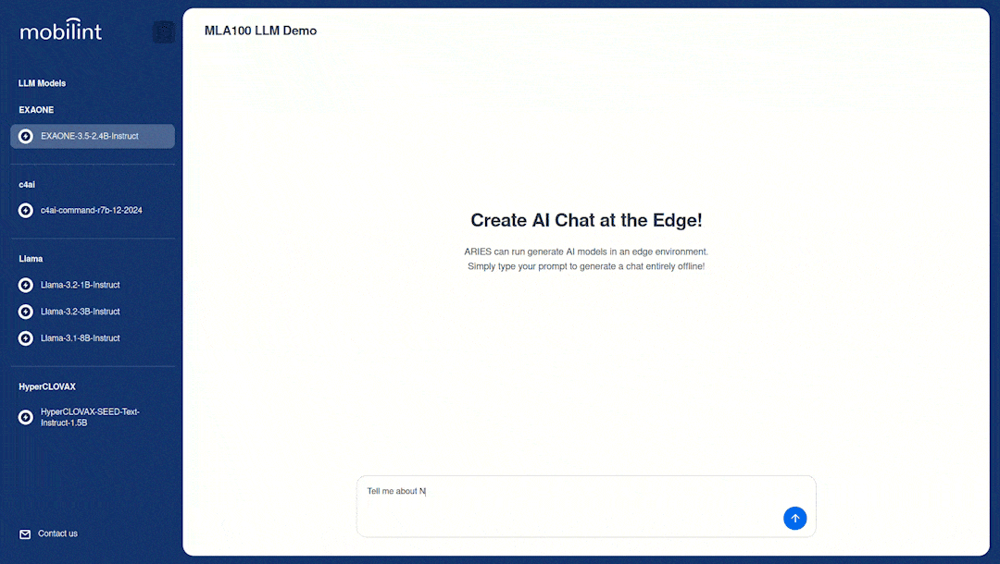
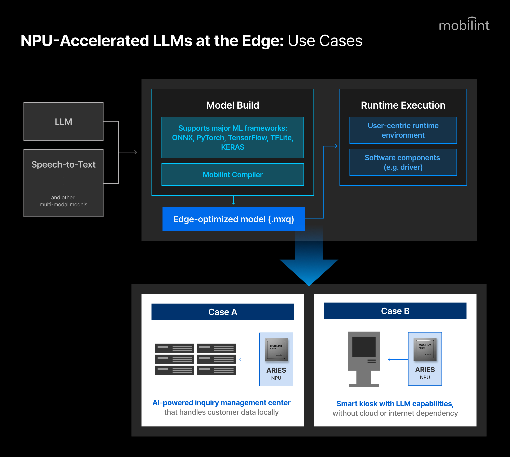

# Mobilint NPU – LLM Inference Demo Container

The **Mobilint NPU LLM Inference Demo Container** provides a fully integrated, ready-to-run environment for executing various large language models (LLMs) locally on Advantech’s edge AI devices embedded with Mobilint’s ARIES-powered **MLA100 MXM AI accelerator module**.

## Overview



This edge LLM demo container features a user-friendly web-based GUI that allows users to select from a list of pre-compiled LLMs without any command-line configuration. It is designed for quick evaluation and demonstration of ARIES’s NPU acceleration in real-world LLM workloads.

All required runtime components and model binaries are preloaded to ensure a smooth out-of-the-box experience. Users can test different models and parameters from the GUI without editing configuration files or entering commands.

## Key Features

- **Browser-based GUI** – Model selection and inference execution from a single dashboard
- **Pre-compiled model set** – Includes INT8-quantized LLMs
- **Optimized Runtime Library** – Hardware-accelerated inference for ARIES NPUs and Python and C++ backend integration for extended development

## Environmental Prerequisites on Host OS

### Hardware

The container is designed to demonstrate Mobilint NPU’s local LLM capabilities as embedded in **AIR-310**, Advantech’s edge AI hardware. Other compatible hosts include:

- Mobilint MLA100 Low Profile PCIe Card

### Software

- Docker Engine ≥ 28.2.2
- Mobilint SDK modules
    - Pre-compiled Mobilint-compatible LLM binaries (.mxq)
    - Mobilint ARIES NPU Driver
        - NOTE: To access the files and modules, please contact tech-support[@mobilint.com](mailto:~~~@mobilint.com).
        
        1. To verify device recognition, run the following command in the terminal:
        `ls /dev | grep aries0`
        If the output includes aries0, the device is recognized by the system.
        2. For Debian-based operating systems, verify driver installation by running:
        `dpkg -l | grep aries-driver`
        If the output contains information about aries-driver, the device driver is installed.
        
    

---

## Container Information

### Directory Structure

```
WIP
```

### Container Components

- Mobilint Runtime Library (latest stable release)
- Web-based GUI frontend (Next.js based)

---

## Quick Start Guide

### Install Docker

Follow the [official instruction](https://docs.docker.com/engine/install/ubuntu/)
Also, set your user as `docker` group by following the [Linux post-installation steps](https://docs.docker.com/engine/install/linux-postinstall/)

You must install `nvidia-container-toolkit` by following [this guide](https://docs.nvidia.com/datacenter/cloud-native/container-toolkit/latest/install-guide.html).

### Create Docker Network & Build Image

```shell
mobilint@mobilint# docker network create mblt_int
mobilint@mobilint# docker compose build
```

### Run

```shell
mobilint@mobilint# docker compose up
```

### Run on background

```shell
mobilint@mobilint# docker compose up -d
```

### Shutdown background

```shell
mobilint@mobilint# docker compose down
```

1. **From the GUI, select a model from the list.**
2. **Interact with the loaded LLM as needed.**
3. **To troubleshoot unexpected errors, please contact tech-support@mobilint.com.**

---

## Advantech × Mobilint: About the Partnership

Advantech and Mobilint have partnered to bring advanced deep learning applications, including large language models (LLMs), multimodal AI, and advanced vision workloads, fully at the edge.

Advantech’s industrial edge hardware, integrating Mobilint’s NPU AI accelerators, provides high-throughput, low-latency inference without cloud dependency.

Preloaded and validated on Advantech systems, Mobilint’s NPU enables immediate deployment of optimized AI applications across industries - including manufacturing, smart infrastructure, robotics, healthcare, and autonomous systems.



---

## License

Copyright © 2025 Mobilint, Inc. All rights reserved.

Provided “as is” without warranties.
